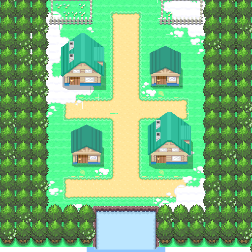
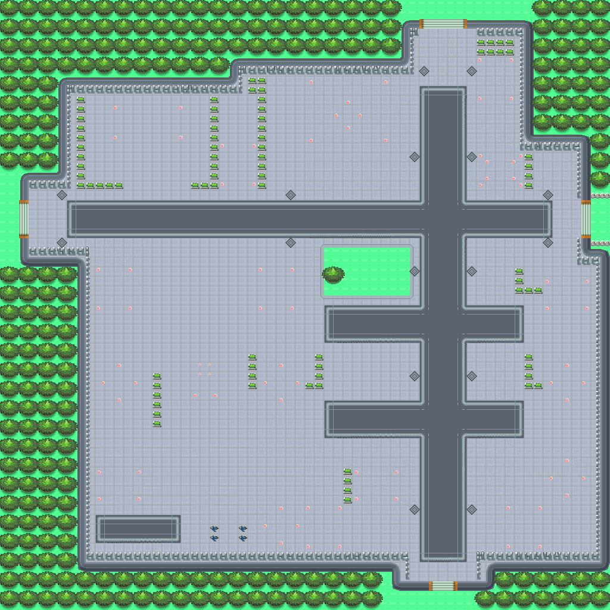
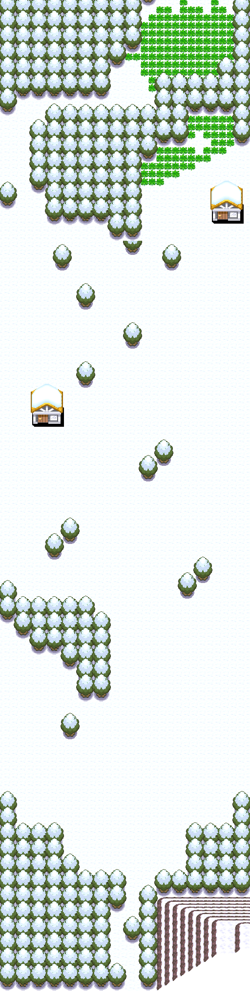

# Pokémon Platinum asset converter

Tools that convert the 3D maps and assets from the
[pret/pokeplatinum](https://github.com/pret/pokeplatinum) decompilation into the
flat 2D format used by this browser game.

Platinum (a Nintendo DS game) renders its overworld in 3D: each map is an NSBMD
model textured with an NSBTX texture set, laid over a 32×32 grid of *terrain
attributes* that drive collision and tile behavior. These tools resolve that
data, render the 3D maps to top-down 2D images, and emit map/layout/collision
data the engine can load directly — so Sinnoh maps look and play like the rest
of the game.

## Pipeline

| Tool | Reads | Writes |
| ---- | ----- | ------ |
| `tools/platinum_common.py` | map headers, matrices, land data | *(shared library — the header→matrix→land-data chain, terrain-attribute decoding, tile-behavior→appearance mapping)* |
| `tools/extract_platinum_maps.py` | land data + events | `data/layouts/sinnoh/*.json`, `data/maps/sinnoh/*.json`, `data/maps/sinnoh_index.json` |
| `tools/nitro_g3d.py` | NSBMD / NSBTX | *(library — DS G3D parser + texture decoder for all 7 DS texture formats)* |
| `tools/render_platinum_maps.py` | land-data NSBMD models + NSBTX texture sets | `data/maps/sinnoh_textured/*.png` |
| `tools/generate_platinum_tileset.py` | layouts | `data/tilesets/sinnoh_overworld.*` (behavior-tile fallback) + previews |

Run order (after checking out the `pokeplatinum` submodule under `source/`):

```sh
python3 tools/extract_platinum_maps.py       # maps, layouts, collision, index
python3 tools/render_platinum_maps.py --all  # textured top-down map images
python3 tools/generate_platinum_tileset.py   # fallback tileset + previews
```

`tools/extract_maps.py` also delegates the Sinnoh portion to
`extract_platinum_maps.py`, so it stays the single entry point for all regions.

## How the conversion works

1. **Map chain.** Each map header (`include/data/map_headers.h`) links a map to
   its events file (its name), its map matrix, and its area data. The matrix
   places the map's 32×32 land-data cells in the world; multi-cell maps (routes,
   cities) are stitched together.
2. **Collision & behavior.** Each land-data cell holds a 32×32 array of 16-bit
   terrain attributes — bit 15 is collision, the low byte is the tile behavior
   (grass, water, ledge, door…). These become the engine's `collision` grid and
   drive the fallback appearance tileset.
3. **3D → 2D render.** The land-data blob also contains the map's NSBMD model.
   `render_platinum_maps.py` interprets the model's NDS GPU display lists into
   textured triangles, samples the map's NSBTX textures, and rasterizes them at
   16 px per tile aligned to the collision grid. The camera uses an **oblique
   (cavalier) projection** rather than a straight top-down one: a tile's height
   lifts it up-screen (`screen_y = z − y·TILT`), so south-facing vertical walls
   — building fronts with doors and windows, cliff faces, ledges — stay visible
   instead of collapsing to nothing, giving the classic GBA "2.5D" look. Flat
   ground (y≈0) is unaffected, so it stays grid-aligned; a depth buffer keyed on
   camera nearness (`z + y`) resolves occlusion. Map props (buildings, doors,
   trees, signs…) are separate NSBMD models placed by the land data — each is
   loaded from `build_model`, transformed by its position/rotation/scale,
   textured from the area's prop texture set, and composited into the same scene.
   `TILT` is tunable via the `PLAT_TILT` env var (default 0.6).
4. **Coordinates.** Event coordinates are translated from global matrix tiles to
   map-local tiles so NPCs, warps and signs line up with the rendered terrain.

## In-engine use

Each Sinnoh layout references its rendered image via a `background` field. The
renderer draws that image as the map background (falling back to the behavior
tileset if it is missing) and uses the `collision` grid for movement. Load any
converted map with `?region=sinnoh&map=<name>` (e.g.
`?region=sinnoh&map=twinleaf_town`).

## Examples

Rendered straight from the game's 3D models (see `previews/`):





## Known limitations

- The Underground (a 15×15-cell matrix) is skipped by the renderer because its
  flattened image would be enormous.
- A handful of materials whose textures are absent from their area's texture set
  render untextured (gray).
- Field *objects* (signposts, mailboxes, berry soil…) and dynamic `VAR_*`
  graphics are not character sprites and still show as placeholder markers;
  character NPCs (~88% of object-event instances) are covered.

## NPC sprites

`extract_platinum_npcs.py` extracts overworld character sprites. Platinum stores
each character as one NSBTX in the `mmodel` archive (16 frames; frame 5 is the
down-facing idle), and the `OBJ_EVENT_GFX_* → mmodel member` map lives in
`Unk_ov5_021FC9B4` (src/overlay005/ov5_021FAF40.c). The tool decodes each
character's down-idle frame, crops it to a 16×32 sprite, and writes
`data/sprites/npcs/platinum/<stem>.png` + an `index.json`. This index is kept
separate from the Kanto/GBA one (many stems collide: youngster, mom, …); the
renderer prefers it only on Sinnoh maps.
